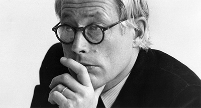

Dieter Rams (born 20 May 1932 in Wiesbaden, Hessen) is a German industrial designer closely associated with the consumer products company Braun and the Functionalist school of industrial design.

Rams began studies in architecture and interior decoration at Wiesbaden School of Art in 1947. Soon after in 1948, he took a break from studying to gain practical experience and conclude his carpentry apprenticeship. He resumed studies at Wiesbaden School of Art in 1948 and graduated with honours in 1953 after which he began working for Frankfurt based architect Otto Apel. In 1955, he was recruited to Braun as an architect and an interior designer. In addition, in 1961, he became the Chief Design Officer at Braun until 1995.

{.size-full .wp-image-2000 .alignright}
Dieter Rams was strongly influenced by the presence of his grandfather, a carpenter. Rams once explained his design approach in the phrase “Weniger, aber besser” which translates as “Less, but better”. Rams and his staff designed many memorable products for Braun including the famous SK-4 record player and the high-quality ‘D’-series (D45, D46) of 35 mm film slide projectors. He is also known for designing the 606 Universal Shelving System by Vitsœ in 1960.

>“What Dieter Rams and his team at Braun did was to produce hundreds of wonderfully conceived and designed objects: products that were beautifully made in high volumes and that were broadly accessible.”
<caption>JONY IVE, APPLE’S SENIOR VICE PRESIDENT OF INDUSTRIAL DESIGN</caption>

By producing electronic gadgets that were remarkable in their austere aesthetic and user friendliness, Rams made Braun a household name in the 1950s. He is considered to be one of the most influential industrial designers of the 20th century.

### Rams’s ten principles of “good design”

Rams introduced the idea of sustainable development and of obsolescence being a crime in design in the 1970s. Accordingly he asked himself the question: is my design good design? The answer formed his now celebrated ten principles.

1. **Is innovative** – The possibilities for progression are not, by any means, exhausted. Technological development is always offering new opportunities for original designs. But imaginative design always develops in tandem with improving technology, and can never be an end in itself.
2. **Makes a product useful** – A product is bought to be used. It has to satisfy not only functional, but also psychological and aesthetic criteria. Good design emphasizes the usefulness of a product whilst disregarding anything that could detract from it.
3. **Is aesthetic** – The aesthetic quality of a product is integral to its usefulness because products are used every day and have an effect on people and their well-being. Only well-executed objects can be beautiful.
4. **Makes a product understandable** – It clarifies the product’s structure. Better still, it can make the product clearly express its function by making use of the user’s intuition. At best, it is self-explanatory.
5. **Is unobtrusive** – Products fulfilling a purpose are like tools. They are neither decorative objects nor works of art. Their design should therefore be both neutral and restrained, to leave room for the user’s self-expression.
6. **Is honest** – It does not make a product appear more innovative, powerful or valuable than it really is. It does not attempt to manipulate the consumer with promises that cannot be kept.
7. **Is long-lasting** – It avoids being fashionable and therefore never appears antiquated. Unlike fashionable design, it lasts many years – even in today’s throwaway society.
8. **Is thorough down to the last detail** – Nothing must be arbitrary or left to chance. Care and accuracy in the design process show respect towards the consumer.
9. **Is environmentally friendly** – Design makes an important contribution to the preservation of the environment. It conserves resources and minimizes physical and visual pollution throughout the lifecycle of the product.
10. **Is as little design as possible** – Less, but better – because it concentrates on the essential aspects, and the products are not burdened with non-essentials. Back to purity, back to simplicity.

### Legacy

The appearance of the calculator application included in iOS 3 mimics the appearance of the 1987 Braun ET 66 calculator designed by Rams and Dietrich Lubs, and the appearance of the now playing screen in Apple’s own Podcast app mimics the appearance of the Braun TG 60 reel-to-reel tape recorder. In Gary Hustwit’s 2009 documentary film Objectified, Rams states that Apple Inc. is one of the few companies designing products according to his principles.
